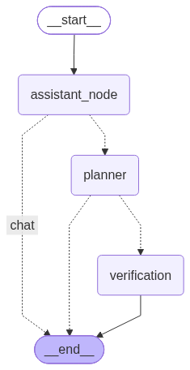

# Inżynierka

## Obecna architektura



## Przykład działania
Kolorowe kropki dodane tylko dla widocznosci w repo
```text
Slucham...

🟢 Audio length: 1.53s

🟢 Whisper: 1.49s

Cześć, nazywam się Michał.

🟣 Ty: Cześć, nazywam się Michał.

🟢 ASR delay: 1.49s

🟢 Conversation node: 1.887s

🟢 Action: chat

🟢 TTS generate: 1.177s | play start: 0.000s | full audio: 1.230s

🟠 Chat: Cześć Michał, miło cię poznać! Jak mogę ci dzisiaj pomóc?

🟢 Overall time: 8.647780179977417 s

🟢 Audio length: 2.04s

🟢 Whisper: 1.51s

Sprawdźmy pogodę w Szczecinie.

🟣 Ty: Sprawdźmy pogodę w Szczecinie.

🟢 ASR delay: 1.51s

🟢 Conversation node: 1.823s

🟢 Action: planner

🟢 TTS generate: 1.308s | play start: 0.000s | full audio: 1.451s

Starting planning...

🟢 Planner (3.098s)

i am verification node

The plan i got
[
  "Wywołaj get_geo_data dla city_name='Szczecin', country_code='PL', limit=1",
  "Wywołaj get_weather z lat/lon zwróconym przez get_geo_data"
]

The task i got:
Sprawdzenie aktualnej pogody w Szczecinie.

🟢 Verification: 0.0000429s

🟠 Chat: Oczywiście, poczekaj chwilę, tylko sprawdzę prognozę pogody dla Szczecina.

🟢 Overall time: 12.375360012054443 s
```'''
